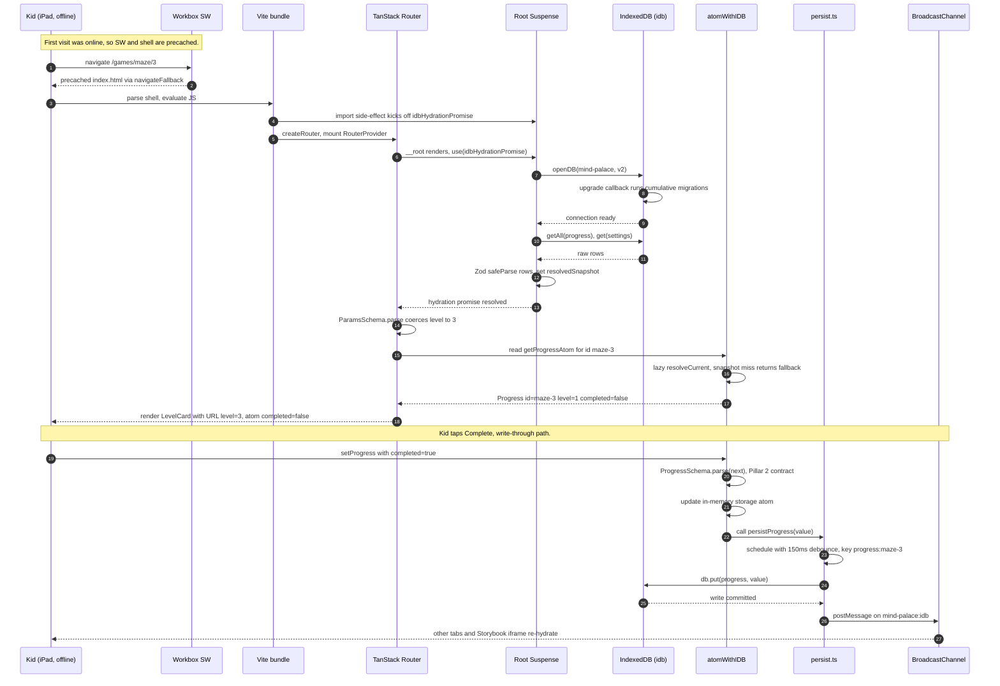

# mind-palace

A rapid-prototyping platform for browser games, optimized for live iPad-over-LAN iteration. Static-only deploy to GitHub Pages, all state in IndexedDB, and a single `bun run check` that gates every change.

> Read [AGENTS.md](./AGENTS.md) for the architectural spec — the *why* behind every constraint here. This README is the **operator's manual**: how to install, develop, test, build, deploy, and review.

---

## Table of contents

- [The Four Pillars](#the-four-pillars-non-negotiable)
- [Included apps](#included-apps)
- [Stack at a glance](#stack-at-a-glance)
- [Prerequisites](#prerequisites)
- [First-time setup](#first-time-setup)
- [Local development](#local-development)
- [The CLI gate](#the-cli-gate--bun-run-check)
- [Local testing](#local-testing)
- [Build & preview](#build--preview)
- [Deploy to GitHub Pages](#deploy-to-github-pages)
- [Architecture (sequence diagram)](#architecture--the-offline-deep-link-contract)
- [Scaffolding new apps](#scaffolding-new-apps)
- [Repository layout](#repository-layout)
- [Code review checklist](#code-review-checklist)
- [Known gaps](#known-gaps)
- [Troubleshooting](#troubleshooting)

---

## The Four Pillars (non-negotiable)

Every change in this repo is judged against these four rules. Anything that violates one is **reverted, not patched**.

1. **Storybook-first** — a component does not exist until a sibling `*.stories.tsx` does. Build the smallest piece in isolation; compose into routes.
2. **Zod-first types** — every prop, atom value, IDB record, env var, and route param starts as `z.object({...})`. The TS type is `z.infer<typeof Schema>`. Hand-written types that mirror a schema are forbidden.
3. **IDB-first state** — IndexedDB is the source of truth; Jotai is its in-memory cache. A single root `<Suspense>` calls `use(idbHydrationPromise)` once at startup; after that, every `atomWithIDB` reads synchronously.
4. **CLI-gate-first** — `bun run check` runs `biome ci → stylelint --max-warnings 0 → tsgo --noEmit → bun test → playwright test`. **Any** warning is a failure.

---

## Included apps

| App | Route | What it teaches |
|---|---|---|
| Ava's Shape Sounds | `/apps/ava-shapes` | Teacher-led spaced-repetition flashcards for square, oval, rhombus, circle, and triangle. The five colorless shapes unlock the colored combinations; PixiJS draws each card and Web Audio composes a shape voice with a color voice. |
| Vector Dungeon | `/apps/vector-dungeon` | A teacher-led coordinate-grid adventure with persisted session progress. |

Open `/apps` from the local app to choose a prototype.

---

## Stack at a glance

| Layer | Tool | Version |
|---|---|---|
| Runtime / package manager | Bun | `1.3.13` (pinned via `packageManager`) |
| Tooling runtime | Node | `25` (`.nvmrc`) |
| Monorepo orchestrator | TurboRepo | `2.x` |
| Language | TypeScript | `7` via [`@typescript/native-preview`](https://github.com/microsoft/typescript-go) — the Go-based `tsgo` compiler; replaces `tsc`. Strict mode + `noUncheckedIndexedAccess` + `exactOptionalPropertyTypes` + `verbatimModuleSyntax`. |
| Framework | TanStack Start | SPA + full prerender (`@tanstack/react-start`) |
| Build engine | Nitro | `v3` (used internally by `@tanstack/react-start`'s prerender pipeline) |
| UI | React | `19` (Compiler enabled) |
| Styling | Tailwind | `v4` (CSS-first via `@theme`) |
| Animation | anime.js | `v4` (named imports only) |
| Canvas / 2D rendering | PixiJS | `8.18.1` — first-party for all canvas-based UI. Mounted via the `usePixiApp(canvasRef, setup, deps)` hook in `app/canvas/`. Same side-channel discipline as anime.js: render stays pure; all `Application.init` / `Ticker` / sprite mutation lives in `useEffect`; `prefers-reduced-motion: reduce` short-circuits Ticker animations. See the 24 `pixijs-*` skills under `.agents/skills/` for the full API surface. |
| State | Jotai | `2.x` (parameterized atoms via the `atomWithIDB` key + a module-scope `Map<id, atom>`; `selectAtom` from `jotai/utils` for derived per-id slices — mind-palace does not use `atomFamily`) |
| Persistence | IndexedDB via `idb` | `8.x` |
| Validation | Zod | `4` |
| Env | `@t3-oss/env-core` | client-only on Pages |
| TS / JS lint + format | Biome | `2.x` |
| CSS lint | Stylelint + Tailwind plugin | `16.x` |
| Component dev | Storybook | `10` (Vite builder) |
| PWA | Vite PWA + Workbox | latest |
| Unit tests | `bun:test` | bundled with Bun |
| Browser tests | Playwright | `1.59+` |
| Local agent orchestration | OpenAI Symphony | Reference runner cloned to ignored `tmp/symphony/`; workflow/spec package in `packages/symphony-first-five`; run with `bun run symphony` or `bun run dev:symphony`. |

---

## Prerequisites

This repo pins both runtimes; install matching versions before anything else.

### 1) Node 25 — toolchain only, never the app runtime

The repo's **`.nvmrc`** pins Node 25. CI reads it (`actions/setup-node@v4` with `node-version-file: ".nvmrc"`); locally, install Node 25 with **nvm**:

```bash
nvm install && nvm use
node -v   # should print v25.x.x
```

> The only Node-version pin in this repo is `.nvmrc`. Don't add `.tool-versions` or a `"volta": {...}` block in `package.json` — `.nvmrc` + the `packageManager` field already pin everything; a second pin format is two sources of truth waiting to drift.

> Node only exists for tools that refuse to run on Bun. The app itself **never** executes on Node — the deploy target is GitHub Pages (static). Don't introduce a Node server.

### 2) Bun 1.3.13 — runtime, package manager, and unit-test runner

Bun is pinned via the root `package.json`'s `packageManager` field. Install:

```bash
# macOS / Linux / WSL
curl -fsSL https://bun.sh/install | bash

# Windows (PowerShell)
irm bun.sh/install.ps1 | iex
```

Verify:
```bash
bun -v    # should print 1.3.13
```

### 3) (Once) Playwright browser binary

Playwright runs against a real Chromium. Install the binary once per machine:
```bash
bunx playwright install chromium
```

CI installs this in the workflow.

---

## First-time setup

```bash
git clone https://github.com/<owner>/mind-palace.git
cd mind-palace

bun install                              # installs every workspace; creates bun.lock
bunx playwright install chromium         # browser binary (one-time per machine)
cp apps/web/.env.example apps/web/.env   # local env file
```

Open `apps/web/.env` and confirm `VITE_GAME_TITLE` is set (the committed default `mind-palace` is fine for development).

> The text lockfile **`bun.lock`** is committed. The older binary form `bun.lockb` is gitignored. Don't commit it.

> Workspace-internal deps use the `workspace:*` protocol — never a published version range. Bun creates symlinks under `node_modules/@mind-palace/*` so Biome, Stylelint, and TS can extend the shared configs.

---

## Local development

```bash
bun run dev
```

`bun run dev` invokes `turbo run dev`, which co-runs every persistent task in the resolved app workspace via Turbo's `with` co-runner. `apps/web` is selected by default while it exists; use `DEAN_APP=<name>` for a generated app.

| Task | URL | Owns |
|---|---|---|
| `dev` | `http://localhost:5173` | Vite dev server (TanStack Start in SPA mode) |
| `storybook` | `http://localhost:6006` | Storybook (component construction surface) |
| `biome:watch` | (terminal) | Lints `.ts` / `.tsx` / `.js` / `.json` on save |
| `stylelint:watch` | (terminal) | Lints `.css` on save |

The watchers print findings in the terminal — **the IDE is not the source of truth** and may not be running.

To run Symphony alongside the same dev stack:

```bash
bun run dev:symphony
DEAN_APP=my-new-game bun run dev:symphony
```

Edit `apps/web/app/components/<name>/index.tsx` — its sibling `index.stories.tsx` lights up immediately. Edit `apps/web/app/styles/index.css` — Tailwind tokens regenerate live. Add a route under `apps/web/app/routes/` — TanStack Router regenerates `routeTree.gen.ts` automatically.

> While developing, watch the **browser console**. A Zod runtime error in dev is a Pillar-2 contract failure — fix it before continuing, same as a TS error.

### react-scan — the React Compiler diagnostic

[`react-scan`](https://github.com/aidenybai/react-scan) is loaded automatically in **Storybook** dev (`.storybook/preview.tsx` imports it behind an `import.meta.env.DEV` guard, so it tree-shakes out of the prod bundle). It outlines components that re-render with a highlighted box.

> **Not loaded in the app dev server.** react-scan v0.5.x patches React 19 in a way that breaks TanStack Router's `HeadContent` (`useContext` returns null at the head-render boundary). Storybook avoids the issue because it doesn't render `HeadContent`. Until the incompatibility is resolved upstream, do component-level re-render diagnostics in Storybook.

**Use it.** When you suspect a render issue — interaction feels janky, animation restarts unexpectedly, a Pixi canvas re-mounts, anything that "looks wrong" — open the route or story in your browser, perform the interaction, and look at the highlighted boxes. A box on a component that shouldn't have re-rendered is a real bug — usually:

- A side-channel violation (anime.js / PixiJS call leaking into render)
- An unstable atom return (a new object identity each `get` instead of a stable reference)
- A missed React Compiler optimization (a Component-defined-inside-Component, a non-pure render, etc.)

**Fix the cause, not the symptom.** Manual `useMemo` / `useCallback` / `React.memo` is forbidden in mind-palace (the React Compiler handles memoization — see `.agents/skills/react-compiler-rules/SKILL.md`). Suppressing the highlight by adding manual memo defeats the diagnostic.

react-scan has no version-specific deprecations, no opinionated patterns, no migration cliffs — there is intentionally **no skill for it**. Just look at the boxes; fix what's bad.

### Running watchers individually

If you want to focus on a subset:

```bash
# from apps/web/
bun run dev               # Vite dev only
bun run storybook         # Storybook only
bun run biome:watch       # Biome lint watcher only
bun run stylelint:watch   # Stylelint watcher only
```

---

## The CLI gate — `bun run check` and `bun run check:fast`

Two flavours of the same gate. **Any warning from any stage is a failure.**

| Command | Chain | When |
|---|---|---|
| `bun run check` | `biome ci → stylelint → tsgo → bun test → build → playwright (storybook + app + app-offline)` | CI, and any time you want full release-quality verification locally |
| `bun run check:fast` | `biome ci → stylelint → tsgo → bun test → playwright --project=storybook` | Pre-push hook, and the inner-loop "is it green yet" check |

`check:fast` skips the `app` and `app-offline` Playwright projects because they spin up `vite preview` against `dist/` — without a fresh build they validate yesterday's bytes. Those are CI's job. The `storybook` project drives `storybook dev`, which is HEAD-valid every run, so it's safe to gate locally.

```bash
bun run check         # full gate
bun run check:fast    # pre-push gate (also auto-runs on `git push`)
```

If either is red, **stop the current task, fix it, and re-run until green** before proceeding.

### Pre-push hook

`bun install` runs the `prepare` script which invokes `bash scripts/install-hooks.sh` — that writes a one-line `.git/hooks/pre-push` that `exec`s `bun run check:fast`. No package dependency, no Bun-postinstall friction. Bypass intentionally with `git push --no-verify` (e.g. pushing a WIP branch you intend to clean up before opening the PR).

### What each stage owns

| Stage | Tool | Owns | Skipping rule |
|---|---|---|---|
| `lint` | `biome ci` | `.ts` / `.tsx` / `.js` / `.json` (Biome's CSS linter is **off** — Stylelint owns CSS) | Don't disable a rule to get green. Fix it. |
| `stylelint` | `stylelint --max-warnings 0` | `.css` only — knows Tailwind v4 directives via `@dreamsicle.io/stylelint-config-tailwindcss` | Don't blanket-ignore `@theme` / `@apply` — install the plugin. |
| `typecheck` | `tsgo --noEmit` | type-check only; emit is Vite's job | Don't `as`-cast at module boundaries — parse with Zod. |
| `test:unit` | `bun test` | pure logic — schemas, atom reducers, IDB migration transforms, parsers | Don't reach for `happy-dom` — DOM tests belong in Playwright. |
| `test:e2e` | `playwright test` | browser-tier — story tests + app workflows + offline deep-link | Don't `test.skip` to make CI green. |

### Skipping rules — when never to skip

- **Don't `--no-verify`** on git hooks. The hook runs the same gate.
- **Don't `// biome-ignore`** without a rule path *and* a justification.
- **Don't disable `--max-warnings 0`** in CI. Fix the warning.

---

## Local testing

Two layers, partitioned by what they need:

### Unit tests — `bun test`

Fast, no browser. Use it for **anything that doesn't need a DOM**: pure functions, Zod schema edge cases, atom reducers, IDB migration *transform functions*, parsers, derived selectors.

```bash
bun test                              # full run (part of the gate)
bun test apps/web/app/state           # path filter
bun test -t "rejects negative"        # name filter
bun test --watch                      # local inner loop
bun test --coverage                   # coverage report
```

Tests live next to their source: `derive.ts` ships with `derive.test.ts` in the same directory. Never split into `__tests__/`.

> **No ASK FIRST is needed for `bun test`** — write unit tests directly when the logic is unit-testable.

### Browser tests — `playwright test`

Three projects, three responsibilities, three test-name suffixes:

| Project | File suffix | URL | Purpose |
|---|---|---|---|
| `storybook` | `*.story.spec.ts` | `localhost:6006/iframe.html?id=...` | Mount a story, assert visible state, ARIA, IDB contents |
| `app` | `*.app.spec.ts` | `localhost:3000` (preview) | End-to-end route workflows (interact → reload → verify) |
| `app-offline` | `*.offline.spec.ts` | `localhost:3000` (preview) | Offline deep-link contract — the load-bearing PWA test |

```bash
bun run test:e2e                                       # all projects
bun run test:e2e -- --project=app                      # app only
bun run test:e2e -- --project=app-offline              # offline only
bun run test:e2e -- --project=storybook --grep @smoke  # smoke subset
bun run test:e2e -- --ui                               # interactive Playwright UI
```

Stack-wide rules baked into `playwright.config.ts`:

- **Reduced motion forced on** at the project level (`use: { reducedMotion: 'reduce' }`). The `useAnime` hook short-circuits, so animations don't add flake. Override per-test only if the animation IS the assertion.
- **Real IndexedDB** — never mocked. Seed via `page.addInitScript`; read via `page.evaluate`.
- **Fresh IDB per test** is the default fixture (`auto: true`).
- **Web-first assertions only** — `await expect(locator).toBeX()`. Never wrap point-in-time methods inside `expect()`.
- **`bun run preview` is the target**, not `bun run dev`. Vite dev does not register the production SW.

### **ASK FIRST** before writing any Playwright test

This is load-bearing per Pillar 4. Before writing or modifying *any* Playwright test, surface the structural choices to whoever owns the feature:

1. Story-level vs app-level vs offline?
2. What to assert: visible text, ARIA, screenshot, IDB contents, network calls?
3. Selector strategy: role > test-id > text?
4. IDB state: fresh, or seeded with what?
5. Network: online, throttled, offline?
6. Reduced motion: forced (default) or no-preference?

Calcifying these without consultation is a Pillar violation. Wait for the answer, **then** write the test.

---

## Build & preview

```bash
bun run build       # vite build (TanStack Start invokes Nitro for the static prerender)
bun run preview     # serve the build at http://localhost:3000
```

What `bun run build` does, in order:

1. **Validates env at build time.** `vite.config.ts` does `import "./app/env"` as a side effect; a `ZodError` here aborts the build before any artifact is uploaded.
2. **Vite bundles the SPA** — React 19, the React Compiler, Tailwind v4.
3. **TanStack Start prerenders every route** with `prerender.failOnError: true` — a missing route fails the build.
4. **Workbox writes `sw.js`** precaching the shell.
5. **Build script** copies `index.html` → `404.html` (GH Pages's SPA fallback), `touch`es `.nojekyll` (insurance against Jekyll stripping `_`-prefixed paths), then runs `scripts/build-sitemap.ts` to walk the prerendered HTML and emit `sitemap.xml` keyed off `VITE_SITE_URL`. The artifact lands at `apps/web/dist/client/`, with `robots.txt`, `llms.txt`, `og-card.svg`, and `sitemap.xml` alongside `index.html`.

Use `bun run preview` to verify locally — that's the same artifact GitHub Pages serves. Playwright `app` and `app-offline` projects run against this preview server, **not** the dev server.

---

## Deploy to GitHub Pages

Two GitHub Actions workflows:

- **`.github/workflows/check.yml`** — runs `bun run check` on every push and PR.
- **`.github/workflows/deploy.yml`** — on push to `main`, builds and uploads the artifact, deploys to Pages.

### One-time GitHub repo setup

1. **Settings → Pages → Build and deployment → Source: GitHub Actions.**
2. **Settings → Environments → `github-pages`** — created automatically by the deploy workflow on first run.
3. **Settings → Secrets and variables → Actions → Variables** — add `VITE_GAME_TITLE` and the SEO contract (`VITE_SITE_URL`, `VITE_SITE_DESCRIPTION`, optionally `VITE_OG_IMAGE`, `VITE_AUTHOR_NAME`, `VITE_AUTHOR_URL`, `VITE_TWITTER_HANDLE`). Defaults are baked into the workflow for `VITE_SITE_URL` (computed from `github.repository_owner`/`github.event.repository.name`) and `VITE_SITE_DESCRIPTION`, so the minimum-viable deploy works without setting any vars — but override `VITE_SITE_URL` to your custom domain if you have one.
   - Values here are **public** — they ship in the JS bundle.
   - **Never** put a real secret in a `VITE_*` field. If you need a private key, GitHub Pages is the wrong target — surface the constraint, don't introduce a server.

### What the deploy workflow does

```yaml
on:
  push: { branches: [main] }
  workflow_dispatch:
    inputs:
      app:
        description: "App to publish (folder name under apps/)"
        default: web
        type: string

env:
  APP: ${{ github.event.inputs.app || vars.PAGES_APP || 'web' }}

steps:
  - actions/checkout@v4
  - actions/setup-node@v4   (with .nvmrc)
  - oven-sh/setup-bun@v2    (reads packageManager pin)
  - id: pages
    uses: actions/configure-pages@v5            # emits the canonical base_path
  - run: bun install --frozen-lockfile
  - run: bunx playwright install --with-deps chromium
  # Pillar 4 — gate runs BEFORE the prod build so we never deploy code
  # that fails lint/types/unit/e2e. check.yml is PR-only; this is the
  # only CI surface that runs on push to main (no parallel workflows).
  - run: bun run check
  - name: Build ${{ env.APP }}
    env:
      BASE_PATH: ${{ steps.pages.outputs.base_path }}
      VITE_GAME_TITLE: ${{ vars.VITE_GAME_TITLE }}
    run: bun run build --filter=@mind-palace/${{ env.APP }}
  # build script handles cp index.html→404.html and touch .nojekyll
  - actions/upload-pages-artifact@v3 (path: apps/${{ env.APP }}/dist/client)
  - actions/deploy-pages@v4
```

**Which app gets published.** `inputs.app` (workflow_dispatch) → `vars.PAGES_APP` (repo variable) → `'web'` (default). Push triggers always pick up `vars.PAGES_APP` or fall back to `web`; `workflow_dispatch` lets you override per-run from the Actions UI.

**Base path is env-driven, not hardcoded.** `actions/configure-pages@v5` outputs `base_path` — `/<repo>` for project pages (`<owner>.github.io/<repo>/`), `/` for user/org pages (`<owner>.github.io`), and `/` for custom domains. The workflow exports that as `BASE_PATH`, and `vite.config.ts`'s `resolveBase()` normalizes it (adds the trailing slash Vite needs). Local dev: `BASE_PATH` is unset → `/`.

### Custom domain or user/org pages

Configure the custom domain in **Settings → Pages**. `actions/configure-pages@v5` will then emit an empty `base_path`, `BASE_PATH` is unset in the build env, and `resolveBase()` returns `/`. No code change required.

### Verifying the live deploy

After the first successful deploy, smoke-test in this order:

1. **Online cold-load** — open the project URL in a fresh browser, confirm the home route renders and the SW installs.
2. **Hard refresh** — confirm the SW serves the shell from cache instantly.
3. **Offline deep-link** — DevTools → Network → Offline → load `<URL>/games/maze/3` directly. Confirm Level 3 renders.

If step 3 fails, the offline contract is broken — see `apps/web/tests/maze-deep-link.offline.spec.ts` for the regression test that should have caught it locally.

---

## Architecture — the offline deep-link contract

The single most important flow: **a kid hitting a deep URL while offline must boot the SPA from cache, hydrate from IDB, and render — with no server round-trip**. Lose this and the iPad-over-LAN scenario breaks.

> **Editing this diagram?** Mermaid's sequence-diagram parser treats `+`, `;`, and `<` followed by a letter (e.g. `<LevelCard ...>`) as syntax tokens inside message and note text — *not* literal characters. Avoid those, then validate with `bunx --bun @mermaid-js/mermaid-cli -i diagram.mmd -o out.svg` before pushing.



Four load-bearing properties this diagram encodes:

- **No network.** Steps 1–3 use only the SW's precache. The router resolves `/games/maze/3` client-side and never asks a server — that route is *not* in the prerender list, so Workbox's `navigateFallback: "/index.html"` (with a denylist that excludes `/assets/*`, image/font extensions, and `/sw.js`) hands back the canonical shell and the router takes over from there.
- **Single Suspense, eager hydration.** `idbHydrationPromise` is a top-level IIFE in `apps/web/app/state/hydration.ts` — step 4 is the *import* side-effect kicking it off, not a function call. By the time `__root.tsx` calls `use(idbHydrationPromise)` (step 6), `openDB` is usually already pending. After `resolvedSnapshot` is populated (step 12), every `atomWithIDB` resolves its initial read synchronously via `getHydratedSnapshot()` — no per-atom suspense, no waterfalls.
- **Two-stage URL → state resolution.** Step 14 (`ParamsSchema.parse`) coerces the URL segment to a typed `level: number` via `z.coerce.number().int().min(1).max(99)`. Step 16 returns the atom's `fallback` (`{ id, level: 1, completed: false }`) because IDB is empty on a cold offline boot — the rendered `LevelCard` displays `level=3` from the URL and `completed=false` from the fallback, even though no progress row exists yet. Writing one (step 19) creates it.
- **Parse on every set, debounced write-through.** Step 20 is Pillar 2 in action — `ProgressSchema.parse(next)` inside `atomWithIDB`'s setter (`apps/web/app/lib/atom-with-idb.ts:36`). An invalid set throws and propagates to the root `errorComponent`. Steps 22–24 isolate IDB writes from React's render pipeline: `persist.ts` schedules a 150ms timer per key (`progress:maze-3`), coalescing rapid taps into a single `db.put`, then posts `{ store, key }` on the `mind-palace:idb` BroadcastChannel so other tabs and the Storybook iframe re-hydrate. The value itself is *not* on the channel — the receiver re-reads from IDB, keeping IDB the single source of truth (Pillar 3).

This contract is verified end-to-end by `apps/web/tests/maze-deep-link.offline.spec.ts` — currently `.skip`'d pending the Workbox / TanStack-Start `_shell.html` rename ordering fix (see [Known gaps](#known-gaps)).

---

## Scaffolding new apps

Add a new mind-palace app — same toolchain, same Pillars, same gate — with the TurboRepo generator at `turbo/generators/config.ts`.

```bash
bun gen:app                                    # interactive prompt for the name
# or, equivalent:
bunx turbo gen run app                         # interactive
```

The generator asks for a kebab-case name (e.g. `test-project`), then scaffolds `apps/<name>/` from `turbo/generators/templates/app/`:

- Full toolchain wiring (Vite + TanStack Start + Tailwind v4 + Storybook + Playwright + Biome + Stylelint)
- Symphony task wiring (`symphony` workspace script) so generated apps work with `bun run symphony` and `bun run dev:symphony`
- Pillar-3 state plumbing (db, hydration, persist, atomWithIDB, migration test)
- Pillar-2 helper (`defineComponent`)
- Motion plumbing (`useAnime`, presets, engine defaults)
- One seed component (`HealthCard`) with co-located story and Playwright story test
- A skipped offline shell test (re-enable once SW generation is wired)

After scaffolding:

```bash
bun install                                    # symlinks the new workspace
bun run check                                  # runs the gate across every app
```

The generator templates substitute `{{name}}` everywhere it matters: `package.json`'s `@mind-palace/<name>`, the IDB database name, the `BroadcastChannel` name, the PWA manifest, the `index.html` `<title>`, the `vite.config.ts` `base` path for project pages, and the default `VITE_GAME_TITLE` in `.env`.

Root app-targeted commands resolve the app workspace through `scripts/resolve-app-filter.ts`: `apps/web` is the default while it exists; if `web` is deleted and only one generated app remains, that app is selected automatically. Use `DEAN_APP=<name>` or `DEAN_APP_FILTER=@scope/name` when multiple apps exist:

```bash
DEAN_APP=my-new-game bun run dev
DEAN_APP=my-new-game bun run dev:symphony
DEAN_APP=my-new-game bun run check:fast
```

Symphony itself is repo-level. Keep the reference runner under ignored `tmp/symphony/` and local Linear credentials under ignored `.symphony/secrets.env`; generated apps reuse `scripts/run-symphony.ts` and `packages/symphony-first-five/WORKFLOW.md`.

> The repo's deploy workflow (`/.github/workflows/deploy.yml`) currently builds and uploads `apps/web` only. To deploy a generator-scaffolded app, either point the workflow at the new app's `dist/client/` or add a parallel workflow per app.

---

## Repository layout

```
mind-palace/
├── apps/
│   └── web/                          # the TanStack Start app
│       ├── app/
│       │   ├── routes/               # file-based routes (TanStack Router)
│       │   ├── components/           # each: index.tsx + schema.ts + stories.tsx + (test.ts)
│       │   ├── state/                # db, hydration, persist, atoms, migrations
│       │   ├── motion/               # useAnime + presets + engine defaults (anime.js side channel)
│       │   ├── canvas/                # usePixiApp hook (PixiJS side channel for canvas UI)
│       │   ├── lib/                  # defineComponent, atomWithIDB
│       │   ├── styles/               # Tailwind entry + @theme tokens
│       │   └── env.ts                # T3 env (build-time validation)
│       ├── tests/                    # Playwright specs + fixtures
│       ├── .storybook/
│       ├── vite.config.ts
│       ├── vite.shared.ts            # plugins shared with Storybook (NEVER fork)
│       └── playwright.config.ts
├── packages/
│   ├── schemas/                      # shared Zod schemas (Score, Settings, Progress)
│   ├── symphony-first-five/          # typed Symphony/Linear issue specs + WORKFLOW.md
│   ├── tsconfig/                     # base.json — every workspace extends this
│   ├── biome-config/                 # extended by root biome.json (root: false)
│   └── stylelint-config/             # extended by root stylelint.config.mjs
├── turbo/
│   └── generators/
│       ├── config.ts                 # `turbo gen run app` — scaffolds new apps
│       └── templates/app/            # template tree mirroring apps/web minus demos
├── .github/workflows/
│   ├── check.yml                     # the gate, on every push/PR
│   └── deploy.yml                    # GH Pages, on push to main
├── biome.json                        # extends @mind-palace/biome-config
├── stylelint.config.mjs              # extends @mind-palace/stylelint-config
├── tsconfig.json
├── scripts/
│   ├── resolve-app-filter.ts         # picks apps/web, DEAN_APP, or the only generated app
│   └── run-symphony.ts               # local OpenAI Symphony wrapper
├── turbo.json                        # task graph + with-co-runners for dev
├── package.json                      # workspaces + packageManager pin
└── AGENTS.md                         # full architectural spec — read first
```

---

## Code review checklist

Every PR is reviewed against the Four Pillars. Anything that violates one is reverted, not patched.

### Pillar 1 — Storybook-first

- [ ] Every new `*.tsx` component has a sibling `*.stories.tsx`?
- [ ] Stories are co-located with the component (no `__stories__/` parallel tree)?
- [ ] No component was built at the route level first?
- [ ] Storybook config (`viteFinal`) re-uses `vite.shared.ts` — not forked?

### Pillar 2 — Zod-first types

- [ ] Every component prop schema is a `z.object`?
- [ ] No hand-written TS type that mirrors an existing Zod schema?
- [ ] Boundary parses use `safeParse` / `parse` — no `as` casts at module boundaries?
- [ ] No `any` — `unknown` + Zod parse instead?
- [ ] Components use `defineComponent(schema, fn)` so dev parses and prod tree-shakes?

### Pillar 3 — IDB-first state

- [ ] Persistent state goes through `atomWithIDB`, never `useState`?
- [ ] Only one `<Suspense>` boundary uses `use(idbHydrationPromise)` (root)?
- [ ] No per-atom suspense?
- [ ] Schema bumps include a migration test (`bun test`)?
- [ ] The service worker doesn't touch IDB?

### Pillar 4 — CLI-gate-first

- [ ] `bun run check` is green locally?
- [ ] Every Playwright test was preceded by an ASK-FIRST round?
- [ ] No rule disabled, no `// biome-ignore` without a justification, no `test.skip`?

### React Compiler purity

- [ ] No manual `useMemo` / `useCallback` / `React.memo`?
- [ ] No anime.js or PixiJS call inside render — both are side channels; all `animate()`, `new Application()`, `Ticker.add(...)`, sprite mutation, and DOM/canvas reads live inside `useEffect` / `useLayoutEffect` / event handlers?
- [ ] No `ref.current = ...` during render?
- [ ] Every animation site uses `useAnime` (anime.js) or `usePixiApp` (PixiJS) — both short-circuit on `prefers-reduced-motion`?

### TanStack Router boundaries

- [ ] `__root__.tsx` declares `errorComponent` and `notFoundComponent`?
- [ ] `router.tsx` wires `defaultErrorComponent` and `defaultNotFoundComponent`?
- [ ] `RouteError` re-throws when `typeof window === "undefined"` so prerender's `failOnError` aborts on real bugs?
- [ ] `app/router.test.ts` still passes — the four wirings are gate-asserted, not a convention?
- [ ] A new game route declares its OWN `errorComponent` for level-tight recovery (root is the safety net, not the first line)?

### PWA contract

- [ ] Workbox `navigateFallback` still points at `/index.html`, denylist still excludes asset URLs?
- [ ] No new precache entry for per-route data (assets only)?
- [ ] No fetch from inside the service worker?

### Deploy hygiene

- [ ] Any new `VITE_*` env var is added in `apps/web/app/env.ts` *and* in `.github/workflows/deploy.yml`'s `env:` block?
- [ ] No entries in `app/env.ts`'s `server: {}` slot (GH Pages is static)?
- [ ] Any new prerendered route is reachable via `<Link>` from another prerendered page (so TanStack Start's `crawlLinks` picks it up) or listed in the `tanstackStart({ prerender: { routes: [...] } })` array?

### SEO and social

- [ ] Any new top-level route declares its own `head` returning `buildSeoLinks({ path })` so a single `<link rel="canonical">` renders (root no longer emits canonical — see `apps/web/app/lib/seo.ts`)?
- [ ] Per-route titles or descriptions go through `buildSeoMeta({ path, title, description })` so OG and Twitter Card tags update in lockstep with the page title?
- [ ] No raw `<meta>` JSX in components — head injection is route-level via TanStack Router's `head` callback, not React tree?
- [ ] `tests/seo.app.spec.ts` still passes — the SEO contract is gate-asserted, not a convention?

---

## Known gaps

The gate runs green today, but three Playwright tests are explicitly `test.skip`'d with documented reasons. They mark contracts that are real but blocked on upstream wiring:

- **`tests/shell.offline.spec.ts` and `tests/maze-deep-link.offline.spec.ts`** — the PWA offline contract. `vite-plugin-pwa`'s `closeBundle` hook runs **before** TanStack Start's prerender renames the SPA shell from `_shell.html` to `index.html`, so no `sw.js` lands in `dist/client/`. Fix: a post-prerender Workbox step (probably a custom Vite plugin invoking Workbox after the rename), or adopt `injectManifest` mode and write the SW by hand. Re-enable once `dist/client/sw.js` lands.
- **`tests/maze-level.app.spec.ts`** — clicking the Complete button calls `setProgress(...)` on the parameterized `getProgressAtom(id)` atom, the schema parses, IDB write is scheduled, but the `LevelCard` keeps showing the "Complete" button branch instead of the "Completed" badge. The atom's stored value flips internally; the consuming `useAtom` doesn't observe the new value until a remount. Confirmed independent of the family layer (un-skipped after the parameterized-atoms rewrite that replaced `jotai-family` with module-scope `Map<id, atom>` memoization, and the test failed identically). Suspect the SENTINEL-to-resolved transition inside `atomWithIDB`'s lazy-read pattern. Re-enable once `atomWithIDB`'s read path is fixed.

Both are tracked as test-skip annotations in-tree; remove the `.skip` once the underlying fix lands.

---

## Troubleshooting

**`tsgo --noEmit` fails with `routeTree.gen.ts` errors after a fresh `bun install`.**
The committed stub has `@ts-nocheck` and is regenerated on `bun run dev`. Run `bun run dev` once, let the TanStack Router plugin overwrite the file, then re-run `bun run check`.

**Playwright `app-offline` test fails locally but passes in CI (or vice versa).**
The offline test runs against `bun run preview`, **not** `bun run dev`. Vite dev does not register the production SW. Stop dev, run `bun run build` then `bun run preview`, and re-run `bun run test:e2e -- --project=app-offline`.

**Biome can't resolve `@mind-palace/biome-config/biome.json`.**
Run `bun install` so workspace symlinks land in `node_modules/@mind-palace/`. If it still fails, swap to a relative extends in `biome.json`: `"extends": ["./packages/biome-config/biome.json"]`.

**`prerender.failOnError` aborts the build with a missing route.**
Add the route to the `tanstackStart({ prerender: { routes: [...] } })` array in `apps/web/vite.config.ts`, or ensure a `<Link to="...">` from a prerendered page reaches it (`crawlLinks: true` will pick it up). Don't set `failOnError: false` — the missing route is the bug.

**Stylelint flags `@theme` / `@apply` / `@import "tailwindcss"`.**
The Tailwind plugin (`@dreamsicle.io/stylelint-config-tailwindcss`) isn't installed or `stylelint.config.mjs` isn't extending `@mind-palace/stylelint-config`. Re-run `bun install`.

**A Zod parse fails in the dev browser console.**
That's a Pillar-2 contract failure of the same severity as a TS error. Fix the schema or the input — never silence the throw.

**`bun.lockb` shows up in `git status`.**
You're on an old Bun version that wrote the binary lockfile. Upgrade to Bun ≥ 1.2 and delete `bun.lockb`. The text `bun.lock` is the only committed lockfile.

**`bun run check` fails on `tsc` because of T3 env's generic types.**
`isolatedDeclarations` is intentionally **off** in `packages/tsconfig/base.json` until the env wiring is annotated. If you've turned it on locally, turn it off or annotate the `env` export explicitly.

**Storybook builds but Tailwind classes don't apply in stories.**
The Tailwind plugin is in `vite.shared.ts` and Storybook re-uses it via `viteFinal`. If classes are missing, somebody forked the Vite config in `.storybook/main.ts` and added `@tailwindcss/vite` separately, which double-runs the plugin. Remove the duplicate.

**`bun run dev` says "no tasks were found" or watchers don't start.**
Each watcher is a Turbo task with `with: ["dev"]` in `turbo.json`, paired with a script in `apps/web/package.json`. If you've renamed one without updating the other, Turbo can't pair them. Check both files match.

**Storybook Playwright tests fail with `ERR_CONNECTION_REFUSED` on the first run after a `bun install`.**
Vite cold-prebundles new dependencies the first time Storybook starts. The Storybook `webServer` in `playwright.config.ts` has `timeout: 180_000` (3 min) to cover this, but a parallel-worker race against the prebundler can still surface as connection refused. Re-run `bun run check` once — the second run hits the warm prebundle cache and goes green. This is the documented "retry once on infra flake" rule (Pillar 4).

---

## Further reading

- [AGENTS.md](./AGENTS.md) — the full architectural spec, including the *why* behind every constraint.
- [`.agents/skills/_OWNERSHIP_MATRIX.md`](./.agents/skills/_OWNERSHIP_MATRIX.md) — which skill owns which API surface.
- [`apps/web/tests/maze-deep-link.offline.spec.ts`](./apps/web/tests/maze-deep-link.offline.spec.ts) — the load-bearing offline-deep-link test the architecture diagram describes.
